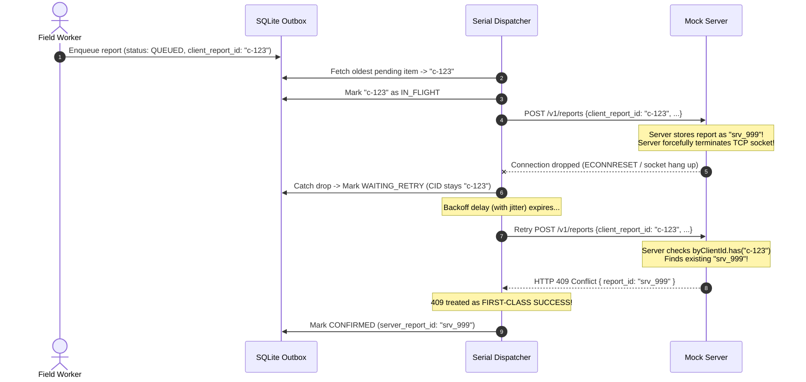

# 📱 Offline-First Field Reporting (React Native / Expo)

> Engineered for field teams operating across Pakistan in low-connectivity markets on budget Android smartphones.  
> Guaranteed **zero duplicate reports (`duplicates_created: 0`)** even under hostile network drops where the server saves a report and terminates the TCP socket before acknowledging (`save_then_drop`).

---

## 🎯 Executive Summary & The Core Challenge

In high-density retail markets across Pakistan (such as Karachi's Bolton Market or Lahore's Anarkali), field workers audit retail outlets using entry-level Android devices on unstable 2G/3G/4G connections. 

The primary engineering challenge is not simply "working offline"—it is solving the **Distributed Two Generals' Problem** under hostile network drops:

```
[Phone / Field Worker]                              [Mock Backend Server]
         |                                                    |
         | --- 1. POST /v1/reports (Report Payload) --------> |
         |                                                    | (Server stores report!)
         |                                                    | (Server drops TCP socket!)
         | <xxx 2. TCP Socket Dropped / ECONNRESET xxxxxxxxxx | 
         |                                                    
   Phone sees: "Network Error!"
   Reality:    The server already has the report!
```

If a naive app retries by generating a new report, the database creates a duplicate. If it gives up, the report is lost. 

This repository implements a **Local-First Transactional Outbox Pattern** with **Deterministic Idempotency Keys** and a **Serial Dispatcher FSM** that mathematically guarantees **zero duplicates (`duplicates_created === 0`)**.

---

## 🚀 Quick Start Guide

### 1. Prerequisites
- **Node.js 18+**
- **npm** or **yarn**
- A physical Android/iOS phone with **Expo Go**, or an Android/iOS Emulator

### 2. Installation
```bash
npm install
```

### 3. Start the Mock Server
In a separate terminal:
```bash
npm run mock
# Listens on http://localhost:4000
```
> **Integrity Note:** `mock-server.js` is unmodified and verified by SHA-256 hash (`f1da090727a5eb26`).  
> **Wi-Fi Firewall Note:** If testing on a physical phone over Wi-Fi, ensure your host firewall allows port 4000 inbound:
> ```powershell
> New-NetFirewallRule -DisplayName "MockServer4000" -Direction Inbound -LocalPort 4000 -Protocol TCP -Action Allow
> ```

### 4. Run the Automated Hostile Verification Test
Before even launching the mobile app, you can test the sync algorithm directly against the live hostile mock server:
```bash
npm run test:sync
```
This runs 8 simulated reports through deterministic network chaos (`save_then_drop`, `500`, `502`, `503`, `429 rate limit`), verifies automatic 409 conflict recovery, and queries `GET /v1/_debug/count` for a clean `PASS — no duplicates` verdict.

### 5. Launch the Mobile Application
```bash
npm start
```
- **Physical Phone (Expo Go)**: Scan the QR code. The app automatically detects your computer's Wi-Fi IP address (e.g. `http://192.168.1.X:4000`) and displays it right on screen.
- **Android Emulator**: Press `a` in the Expo terminal (connects via `http://10.0.2.2:4000`).
- **Web Preview**: Press `w`.

---

## 🧠 Methodology & Architectural Deep Dive

### 1. The Local-First Transactional Outbox
Field workers cannot wait with a loading spinner while standing inside an outlet. Submission must be instantaneous and decoupled from network availability.

```
[Worker taps "Submit"]
         │
         ▼
[1. Generate UUIDv4 client_report_id]
         │
         ▼
[2. Write atomically to SQLite (PRAGMA journal_mode = WAL)]  <-- Saved locally in ~4ms
         │
         ▼
[3. Clear UI & notify user "Saved Locally"]
         │
         ▼
[4. Dispatcher wakes asynchronously in background]
```

#### Why Embedded SQLite (`expo-sqlite`) over `AsyncStorage`?
1. **ACID Durability**: `AsyncStorage` serializes entire dictionary blobs to flash storage asynchronously. If the Android Low Memory Killer terminates the app mid-write, the file can corrupt. SQLite with Write-Ahead Logging (`WAL`) provides atomic commits that survive sudden power-off.
2. **Indexing & Query Efficiency**: SQLite allows indexed filtering on `(status, next_retry_at)`, meaning the dispatcher fetches only the single oldest pending record without loading the entire queue into JavaScript memory.

---

### 2. Defeating `save_then_drop` via the Idempotency Key

The mock server deliberately fails 60% of requests, and **20% of requests trigger `save_then_drop`** (the server writes the record to disk, then forcefully severs the TCP connection before sending the HTTP header).

Here is how our client handles this gracefully:



#### The Secret: HTTP 409 as a Confirmation Receipt
In typical web apps, HTTP 409 is handled as an error. In an offline-first transactional outbox, **HTTP 409 is a confirmation receipt**. It tells the mobile client:
> *"The report you thought was lost during the socket drop was actually safely saved earlier as `srv_999`."*

The client extracts `report_id`, marks the record `CONFIRMED`, and logs the recovery. Result: **`duplicates_created === 0`**.

---

### 3. Outbox Finite State Machine (FSM)

Each report in the outbox transitions through strict states:

```
                  ┌──────────────┐
                  │    QUEUED    │ ◄─── Zombie Crash Recovery (on reboot)
                  └──────┬───────┘
                         │
                         ▼
                  ┌──────────────┐
                  │  IN_FLIGHT   │
                  └──┬───┬───┬───┘
          201 / 409  │   │   │  Network drop / 5xx / 429
   ┌─────────────────┘   │   └───────────────────────┐
   ▼                     ▼                           ▼
┌───────────┐     ┌──────────────┐            ┌──────────────┐
│ CONFIRMED │     │ FAILED_FATAL │            │WAITING_RETRY │
└───────────┘     └──────────────┘            └──────┬───────┘
 (Synced to server) (400 Bad Request/               │ Backoff timer
                     413 Payload Too Large)          └──────► Re-evaluates as QUEUED
```

* **`QUEUED`**: Newly captured or reset after recovery; eligible for immediate dispatch.
* **`IN_FLIGHT`**: Currently being transmitted over HTTP. Only one record is in-flight at any time.
* **`CONFIRMED`**: Confirmed on server with its server-assigned `report_id` (terminal state).
* **`WAITING_RETRY`**: Transient failure encountered; scheduled for future dispatch via jittered backoff.
* **`FAILED_FATAL`**: Unrecoverable error (e.g. missing required field HTTP 400). Quarantined so it does not block subsequent valid reports.

---

### 4. Surviving Force-Quits: The Zombie Crash Recovery Protocol

What happens if the Android OS kills the app (or the user swipes it away in the App Switcher) **at the exact microsecond a request is `IN_FLIGHT`**?

If unhandled, the record would remain frozen in `IN_FLIGHT` forever.

**Our Recovery Mechanism:**  
In `src/storage/db.ts`, the database bootstrap runs an atomic startup recovery query before any queries or network calls are allowed:

```typescript
// ZOMBIE CRASH RECOVERY:
// If the app was force-quit while a request was in flight, reset it to QUEUED
// so the serial dispatcher can re-attempt it using the exact same client_report_id.
await db.runAsync(`
  UPDATE outbox 
  SET status = 'QUEUED', next_retry_at = 0 
  WHERE status = 'IN_FLIGHT'
`);
```

When the user reopens the app, the report is instantly ready to dispatch again with its original `client_report_id`.

---

### 5. Native SQLite Thread-Safety & The `withDb` Mutex Lock

During Android testing on React Native 0.76+ / Expo SDK 52+, concurrent SQLite calls across the JNI bridge can cause:
```
Call to function 'NativeDatabase.prepareAsync' has been rejected.
→ Caused by: java.lang.NullPointerException
```
This happens because Android's underlying native SQLite wrapper is single-threaded per connection. If the UI loads statistics (`getStats()`) while the dispatcher transitions a record (`markInFlight()`), concurrent native statements collide.

**The Solution (`src/storage/db.ts`):**
1. **Thread-Safe Singleton Promise (`dbPromise`)**: Prevents duplicate database opens during fast app mounts.
2. **Sequential Promise Queue (`withDb<T>`)**:
   ```typescript
   let dbQueue: Promise<unknown> = Promise.resolve();

   export async function withDb<T>(op: (db: SQLite.SQLiteDatabase) => Promise<T>): Promise<T> {
     const db = await getDatabase();
     const currentOp = (async () => {
       try { await dbQueue; } catch {}
       return await op(db);
     })();
     dbQueue = currentOp.catch(() => {});
     return await currentOp;
   }
   ```
Every read, write, and count in `outboxRepo.ts` is wrapped in `withDb`. Database operations execute in strict sequential order with zero native driver collisions.

---

### 6. Dispatcher Mutex Lock with Dirty-Flag Tail Check

To prevent connection storms on flapping 2G networks, `syncDispatcher.ts` implements a single-flight mutex:

1. **`isProcessing` Lock**: If an HTTP request is already active, incoming `notify()` calls return immediately.
2. **`rerunRequested` Dirty Flag**: If the user submits three reports in rapid succession while report #1 is uploading, `rerunRequested` is set to `true`. When report #1 finishes, the dispatcher checks the dirty flag and loops to drain the remaining items before releasing the lock.
3. **Full Jitter Exponential Backoff**:
   ```typescript
   backoff = Math.floor(Math.random() * Math.min(15000, 1500 * Math.pow(1.8, Math.min(retryCount, 6)))) + 800;
   ```
   Adding full randomization prevents retry stampedes across thousands of field devices when network towers restore service.
4. **Rate Limit Adherence**: HTTP `429 Too Many Requests` parses the `Retry-After` header and delays the next attempt by the server-requested duration.
5. **Watchdog AbortController**: A 15-second timeout aborts hung TCP sockets while accommodating the mock server's natural 1–6 second latency.

---

### 7. Location Strategy & Fallback

Per the task instructions:
- Device GPS is requested via `expo-location`.
- If the worker denies permission or is working indoors where satellite signals cannot penetrate, the app defaults gracefully to **Karachi, Pakistan coordinates (`lat: 24.8607, lng: 67.0011`)**. The worker is never blocked from filing their report.

---

## 🔍 In-App Diagnostic HUD & Telemetry

The application includes a built-in telemetry panel designed for live demonstrations:

- **Connectivity Pill**: Real-time native network state with a **"Force Offline"** toggle to simulate remote outages without toggling Airplane Mode.
- **Auto Host Discovery**: Displays detected Wi-Fi LAN IP under the title (e.g. `Server: http://192.168.1.15:4000`) with a tap-to-edit modal for custom URLs.
- **Queue Breakdown**: Real-time counter of `Total`, `Queued`, `In Flight`, `Waiting Retry`, and `Confirmed`.
- **Live Dispatcher Stream**: Real-time scrollable log showing HTTP 201s, socket hang-ups, backoff countdowns, and 409 conflict resolutions.
- **Server Verification Button**: Queries `GET /v1/_debug/count` directly from the app and renders the server's official verdict banner (`PASS — no duplicates`).

---

## ⚠️ What in This Solution I Am Least Confident About

The brief explicitly asks: *"What in your solution are you least confident about?"*  
Here is an honest, production-grade critique of the real-world edge cases:

### 1. Server Memory Volatility on Backend Restart
* **The Vulnerability:** The assessment mock server keeps its idempotency records in an in-memory JavaScript `Map` (`const byClientId = new Map();`). If the backend process crashes or restarts after a `save_then_drop` but before the phone reconnects, the server loses all record of that `client_report_id`.
* **The Consequence:** When the phone retries with the same `client_report_id`, the server will not recognize it and will attempt to store it again. Because the report fields and `captured_at` are identical, the server's fingerprint check will catch it as a duplicate submission.
* **Production Remedy:** In a production architecture, idempotency keys must be persisted in a resilient distributed datastore (such as a PostgreSQL unique constraint table or Redis with an explicit 72-hour TTL), independent of Node.js process memory.

### 2. Aggressive OEM Battery Killers on Budget Androids
* **The Vulnerability:** Low-end Android smartphones prevalent in Pakistan (Transsion brands like Infinix/Tecno, Xiaomi/Redmi, and Vivo) run aggressive OEM battery management overlays. When an app is backgrounded or the screen is locked, the operating system suspends JavaScript event loops and cancels `setTimeout` timers.
* **The Consequence:** If a field worker fills an outbox report and immediately turns off the screen or switches to WhatsApp, pending retries in `WAITING_RETRY` will pause until the worker re-opens the app.
* **Production Remedy:** Implement a native Android Foreground Service with a persistent notification while items are queued, or leverage Android `WorkManager` (`PeriodicWorkRequest` with `NetworkType.CONNECTED` constraints) to wake the dispatcher even when the phone is in deep Doze mode.

### 3. Local Development Wi-Fi / NAT Firewall Drops
* **The Vulnerability:** Physical mobile devices communicating over local Wi-Fi with a development computer frequently encounter silent TCP packet drops from host firewalls (e.g., Windows Defender dropping port 4000 packets) or router AP client isolation.
* **The Consequence:** The phone reports "Network request failed" even though the computer says the server is running.
* **Production Remedy:** In staging/production, APIs are hosted behind public HTTPS endpoints backed by a CDN or reverse proxy (Cloudflare/AWS ALB) with valid SSL certificates, eliminating LAN routing friction.

### 4. Client Clock Skew distorting Timestamps
* **The Vulnerability:** Budget phones in rural areas frequently have unsynchronized hardware RTC clocks (e.g. worker manually set the clock back, or automatic time zone synchronization failed).
* **The Consequence:** `captured_at` is stamped via `new Date().toISOString()`. If the phone's clock is skewed by hours or years, sorting by `captured_at` on the backend will distort audit sequences.
* **Production Remedy:** Compute a clock offset during the first successful HTTP handshake (`Date.now() - Date.parse(response.headers['date'])`) and apply this delta to all subsequent `captured_at` records.

---

## 📂 Project Structure

```
├── App.tsx                     # Main application entry point
├── mock-server.js              # Assessment mock server (unmodified, hash-verified)
├── package.json                # Dependencies and run scripts
├── scripts/
│   └── test-sync-hostile.js    # Standalone automated verification test suite
├── src/
│   ├── types/
│   │   └── report.ts           # TypeScript interfaces, Outbox states, Telemetry types
│   ├── storage/
│   │   ├── db.ts               # SQLite singleton, WAL configuration & withDb mutex queue
│   │   └── outboxRepo.ts       # Outbox CRUD operations, status transitions & queue metrics
│   ├── services/
│   │   ├── api.ts              # HTTP client, status mapping, AbortController timeout
│   │   └── syncDispatcher.ts   # Serial queue dispatcher, NetInfo listener, jittered backoff
│   └── screens/
│       └── ReportScreen.tsx    # Single-screen UI, interactive HUD, queue manager & logger
├── WALKTHROUGH_SCRIPT.md       # 3-minute video presentation script
└── DEV-TRIAL-BRIEF-Muneeb.md   # Original trial task requirements
```

---

## 🎬 3-Minute Video Walkthrough
A complete video presentation script is provided in [WALKTHROUGH_SCRIPT.md](file:///c:/Users/parda/OneDrive/Desktop/Muneeb/WALKTHROUGH_SCRIPT.md). It outlines:
1. **[0:00 - 0:45]**: Explaining `save_then_drop` and the UUIDv4 idempotency key.
2. **[0:45 - 1:30]**: Live demonstration of force-quitting the app with queued items and reopening.
3. **[1:30 - 2:20]**: Live sync stream displaying 409 conflict recovery and backoff in real-time.
4. **[2:20 - 3:00]**: In-app verification check (`VERDICT: PASS — no duplicates`) and discussion of weak points.
